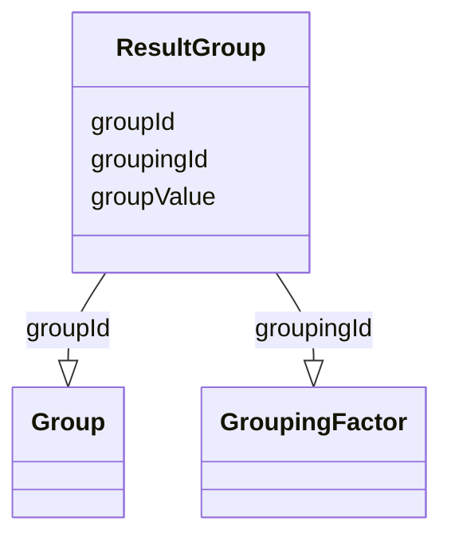

# Class: ResultGroup


_For the specified grouping factor, an indication of the specific group of subjects or data records associated with the analysis result._


URI: [ars:ResultGroup](https://www.cdisc.org/ars/1-0/ResultGroup)





<!-- no inheritance hierarchy -->


## Slots

| Name | Cardinality and Range | Description | Inheritance |
| ---  | --- | --- | --- |
| [groupingId](groupingId.md) | 0..1 <br/> [GroupingFactor](GroupingFactor.md) | The identifier of the referenced subject or data grouping factor | direct |
| [groupId](groupId.md) | 0..1 <br/> [Group](Group.md) | The identifier of a referenced predefined group within a grouping | direct |
| [groupValue](groupValue.md) | 0..1 <br/> [String](String.md) | The data value used as a group within a data-driven grouping | direct |


## Usages

| used by | used in | type | used |
| ---  | --- | --- | --- |
| [OperationResult](OperationResult.md) | [resultGroups](resultGroups.md) | range | [ResultGroup](ResultGroup.md) |


## Identifier and Mapping Information


### Schema Source


* from schema: https://www.cdisc.org/ars/1-0


## Mappings

| Mapping Type | Mapped Value |
| ---  | ---  |
| self | ars:ResultGroup |
| native | ars:ResultGroup |


## LinkML Source

<!-- TODO: investigate https://stackoverflow.com/questions/37606292/how-to-create-tabbed-code-blocks-in-mkdocs-or-sphinx -->

### Direct

<details>
```yaml
name: ResultGroup
description: For the specified grouping factor, an indication of the specific group
  of subjects or data records associated with the analysis result.
from_schema: https://www.cdisc.org/ars/1-0
rank: 1000
slots:
- groupingId
- groupId
- groupValue

```
</details>

### Induced

<details>
```yaml
name: ResultGroup
description: For the specified grouping factor, an indication of the specific group
  of subjects or data records associated with the analysis result.
from_schema: https://www.cdisc.org/ars/1-0
rank: 1000
attributes:
  groupingId:
    name: groupingId
    description: The identifier of the referenced subject or data grouping factor.
    from_schema: https://www.cdisc.org/ars/1-0
    rank: 1000
    alias: groupingId
    owner: ResultGroup
    domain_of:
    - OrderedGroupingFactor
    - ResultGroup
    range: GroupingFactor
    inlined: false
  groupId:
    name: groupId
    description: The identifier of a referenced predefined group within a grouping.
    from_schema: https://www.cdisc.org/ars/1-0
    rank: 1000
    alias: groupId
    owner: ResultGroup
    domain_of:
    - ResultGroup
    range: Group
    inlined: false
  groupValue:
    name: groupValue
    description: The data value used as a group within a data-driven grouping.
    from_schema: https://www.cdisc.org/ars/1-0
    rank: 1000
    alias: groupValue
    owner: ResultGroup
    domain_of:
    - ResultGroup
    range: string

```
</details>