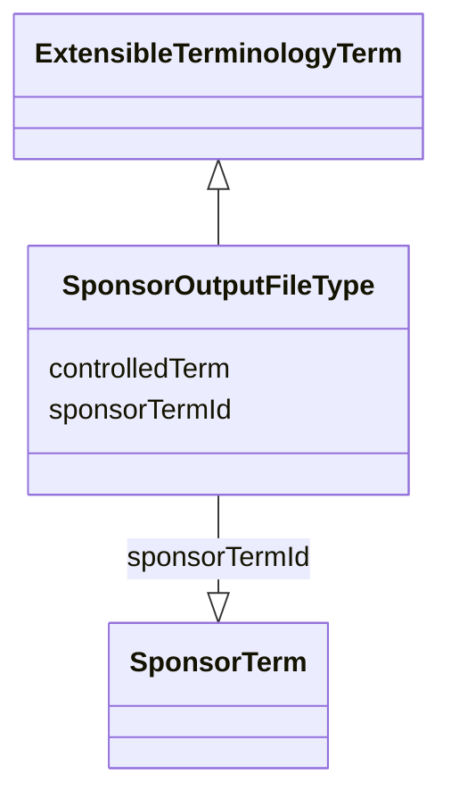

# Class: SponsorOutputFileType


URI: [ars:SponsorOutputFileType](https://www.cdisc.org/ars/1-0/SponsorOutputFileType)





## Inheritance
* [ExtensibleTerminologyTerm](ExtensibleTerminologyTerm.md)
    * **SponsorOutputFileType**


## Slots

| Name | Cardinality and Range | Description | Inheritance |
| ---  | --- | --- | --- |
| [controlledTerm](controlledTerm.md) | 0..1 <br/> [String](String.md) |  | [ExtensibleTerminologyTerm](ExtensibleTerminologyTerm.md) |
| [sponsorTermId](sponsorTermId.md) | 1..1 <br/> [SponsorTerm](SponsorTerm.md) |  | [ExtensibleTerminologyTerm](ExtensibleTerminologyTerm.md) |


## Identifier and Mapping Information


### Schema Source


* from schema: https://www.cdisc.org/ars/1-0


## Mappings

| Mapping Type | Mapped Value |
| ---  | ---  |
| self | ars:SponsorOutputFileType |
| native | ars:SponsorOutputFileType |


## LinkML Source

<!-- TODO: investigate https://stackoverflow.com/questions/37606292/how-to-create-tabbed-code-blocks-in-mkdocs-or-sphinx -->

### Direct

<details>
```yaml
name: SponsorOutputFileType
from_schema: https://www.cdisc.org/ars/1-0
rank: 1000
is_a: ExtensibleTerminologyTerm
slot_usage:
  controlledTerm:
    name: controlledTerm
    domain_of:
    - ExtensibleTerminologyTerm
    value_presence: ABSENT
  sponsorTermId:
    name: sponsorTermId
    domain_of:
    - ExtensibleTerminologyTerm
    required: true
    value_presence: PRESENT

```
</details>

### Induced

<details>
```yaml
name: SponsorOutputFileType
from_schema: https://www.cdisc.org/ars/1-0
rank: 1000
is_a: ExtensibleTerminologyTerm
slot_usage:
  controlledTerm:
    name: controlledTerm
    domain_of:
    - ExtensibleTerminologyTerm
    value_presence: ABSENT
  sponsorTermId:
    name: sponsorTermId
    domain_of:
    - ExtensibleTerminologyTerm
    required: true
    value_presence: PRESENT
attributes:
  controlledTerm:
    name: controlledTerm
    from_schema: https://www.cdisc.org/ars/1-0
    rank: 1000
    alias: controlledTerm
    owner: SponsorOutputFileType
    domain_of:
    - ExtensibleTerminologyTerm
    range: string
    value_presence: ABSENT
  sponsorTermId:
    name: sponsorTermId
    from_schema: https://www.cdisc.org/ars/1-0
    rank: 1000
    alias: sponsorTermId
    owner: SponsorOutputFileType
    domain_of:
    - ExtensibleTerminologyTerm
    range: SponsorTerm
    required: true
    inlined: false
    value_presence: PRESENT

```
</details>