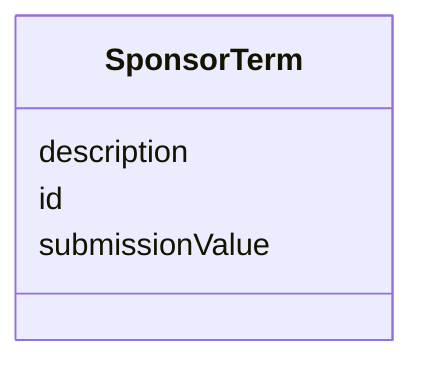

# Class: SponsorTerm

_A sponsor-defined term that is included in an extensible set of controlled terminology._


URI: [ars:SponsorTerm](https://www.cdisc.org/ars/1-0/SponsorTerm)





<!-- no inheritance hierarchy -->


## Slots

| Name | Cardinality* and Range | Description | Inheritance |
| ---  | --- | --- | --- |
| [id](id.md) | 1..1 <br/> [String](String.md) | The assigned identifying value for the instance of the class | direct |
| [submissionValue](submissionValue.md) | 1..1 <br/> [String](String.md) | The specific value expected for submissions | direct |
| [description](description.md) | 0..1 <br/> [String](String.md) | A textual description of the instance of the class | direct |

_* See [LinkML documentation](https://linkml.io/linkml/schemas/slots.html#slot-cardinality) for cardinality definitions._


## Usages

| used by | used in | type | used |
| ---  | --- | --- | --- |
| [TerminologyExtension](TerminologyExtension.md) | [sponsorTerms](sponsorTerms.md) | range | [SponsorTerm](SponsorTerm.md) |
| [ExtensibleTerminologyTerm](ExtensibleTerminologyTerm.md) | [sponsorTermId](sponsorTermId.md) | range | [SponsorTerm](SponsorTerm.md) |
| [OperationRole](OperationRole.md) | [sponsorTermId](sponsorTermId.md) | range | [SponsorTerm](SponsorTerm.md) |
| [SponsorOperationRole](SponsorOperationRole.md) | [sponsorTermId](sponsorTermId.md) | range | [SponsorTerm](SponsorTerm.md) |
| [AnalysisReason](AnalysisReason.md) | [sponsorTermId](sponsorTermId.md) | range | [SponsorTerm](SponsorTerm.md) |
| [SponsorAnalysisReason](SponsorAnalysisReason.md) | [sponsorTermId](sponsorTermId.md) | range | [SponsorTerm](SponsorTerm.md) |
| [AnalysisPurpose](AnalysisPurpose.md) | [sponsorTermId](sponsorTermId.md) | range | [SponsorTerm](SponsorTerm.md) |
| [SponsorAnalysisPurpose](SponsorAnalysisPurpose.md) | [sponsorTermId](sponsorTermId.md) | range | [SponsorTerm](SponsorTerm.md) |
| [OutputFileType](OutputFileType.md) | [sponsorTermId](sponsorTermId.md) | range | [SponsorTerm](SponsorTerm.md) |
| [SponsorOutputFileType](SponsorOutputFileType.md) | [sponsorTermId](sponsorTermId.md) | range | [SponsorTerm](SponsorTerm.md) |


## Identifier and Mapping Information


### Schema Source


* from schema: https://www.cdisc.org/ars/1-0


## Mappings

| Mapping Type | Mapped Value |
| ---  | ---  |
| self | ars:SponsorTerm |
| native | ars:SponsorTerm |


## LinkML Source

<!-- TODO: investigate https://stackoverflow.com/questions/37606292/how-to-create-tabbed-code-blocks-in-mkdocs-or-sphinx -->

### Direct

<details>
```yaml
name: SponsorTerm
description: A sponsor-defined term that is included in an extensible set of controlled
  terminology.
from_schema: https://www.cdisc.org/ars/1-0
rank: 1000
slots:
- id
- submissionValue
- description

```
</details>

### Induced

<details>
```yaml
name: SponsorTerm
description: A sponsor-defined term that is included in an extensible set of controlled
  terminology.
from_schema: https://www.cdisc.org/ars/1-0
rank: 1000
attributes:
  id:
    name: id
    description: The assigned identifying value for the instance of the class.
    from_schema: https://www.cdisc.org/ars/1-0
    rank: 1000
    identifier: true
    alias: id
    owner: SponsorTerm
    domain_of:
    - ReportingEvent
    - ReferenceDocument
    - TerminologyExtension
    - SponsorTerm
    - AnalysisCategorization
    - AnalysisCategory
    - AnalysisSet
    - DataSubset
    - GroupingFactor
    - Group
    - AnalysisMethod
    - Operation
    - ReferencedOperationRelationship
    - Analysis
    - DisplaySubSection
    - Output
    - OutputDisplay
    range: string
    required: true
  submissionValue:
    name: submissionValue
    description: The specific value expected for submissions.
    from_schema: https://www.cdisc.org/ars/1-0
    rank: 1000
    alias: submissionValue
    owner: SponsorTerm
    domain_of:
    - SponsorTerm
    range: string
    required: true
  description:
    name: description
    description: A textual description of the instance of the class.
    from_schema: https://www.cdisc.org/ars/1-0
    rank: 1000
    alias: description
    owner: SponsorTerm
    domain_of:
    - SponsorTerm
    - AnalysisMethod
    - ReferencedOperationRelationship
    - CodeParameter
    - Analysis
    range: string

```
</details>