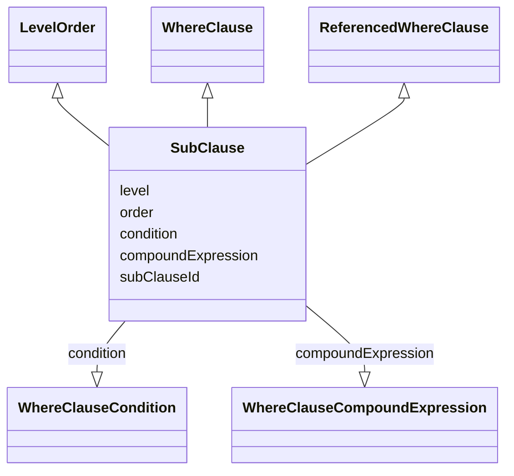

# Class: SubClause

_An abstract class containing all attributes that may be specified for a sub-clause of a compound expression. In practice, each sub-clause will be either a fully-defined `WhereClause` (containing either a `condition` or a `compoundExpression`) or a `ReferencedWhereClause` (containing a `subClauseId`)._


* __NOTE__: this is an abstract class and should not be instantiated directly

URI: [ars:SubClause](https://www.cdisc.org/ars/1-0/SubClause)





## Inheritance
* **SubClause** [ [LevelOrder](LevelOrder.md) [WhereClause](WhereClause.md) [ReferencedWhereClause](ReferencedWhereClause.md)]


## Slots

| Name | Cardinality* and Range | Description | Inheritance |
| ---  | --- | --- | --- |
| [level](level.md) | 1..1 <br/> [Integer](Integer.md) | The level of the entry within a hierarchical structure | [LevelOrder](LevelOrder.md) |
| [order](order.md) | 1..1 <br/> [Integer](Integer.md) | The ordinal of the instance with respect to other instances | [LevelOrder](LevelOrder.md) |
| [condition](condition.md) | 0..1 <br/> [WhereClauseCondition](WhereClauseCondition.md) | A simple selection criterion exressed as [dataset] | [WhereClause](WhereClause.md) |
| [compoundExpression](compoundExpression.md) | 0..1 <br/> [WhereClauseCompoundExpression](WhereClauseCompoundExpression.md) | A compound expression that combines or negates where clauses | [WhereClause](WhereClause.md) |
| [subClauseId](subClauseId.md) | 0..1 <br/> [String](String.md) | The identifier of the analysis set, data subset or group referenced in the co... | [ReferencedWhereClause](ReferencedWhereClause.md) |

_* See [LinkML documentation](https://linkml.io/linkml/schemas/slots.html#slot-cardinality) for cardinality definitions._


## Usages

| used by | used in | type | used |
| ---  | --- | --- | --- |
| [WhereClauseCompoundExpression](WhereClauseCompoundExpression.md) | [whereClauses](whereClauses.md) | range | [SubClause](SubClause.md) |
| [CompoundSetExpression](CompoundSetExpression.md) | [whereClauses](whereClauses.md) | range | [SubClause](SubClause.md) |
| [CompoundSubsetExpression](CompoundSubsetExpression.md) | [whereClauses](whereClauses.md) | range | [SubClause](SubClause.md) |
| [CompoundGroupExpression](CompoundGroupExpression.md) | [whereClauses](whereClauses.md) | range | [SubClause](SubClause.md) |


## Identifier and Mapping Information


### Schema Source


* from schema: https://www.cdisc.org/ars/1-0


## Mappings

| Mapping Type | Mapped Value |
| ---  | ---  |
| self | ars:SubClause |
| native | ars:SubClause |


## LinkML Source

<!-- TODO: investigate https://stackoverflow.com/questions/37606292/how-to-create-tabbed-code-blocks-in-mkdocs-or-sphinx -->

### Direct

<details>
```yaml
name: SubClause
description: An abstract class containing all attributes that may be specified for
  a sub-clause of a compound expression. In practice, each sub-clause will be either
  a fully-defined `WhereClause` (containing either a `condition` or a `compoundExpression`)
  or a `ReferencedWhereClause` (containing a `subClauseId`).
from_schema: https://www.cdisc.org/ars/1-0
rank: 1000
abstract: true
mixins:
- LevelOrder
- WhereClause
- ReferencedWhereClause
slot_usage:
  subClauseId:
    name: subClauseId
    domain_of:
    - ReferencedWhereClause
    required: false

```
</details>

### Induced

<details>
```yaml
name: SubClause
description: An abstract class containing all attributes that may be specified for
  a sub-clause of a compound expression. In practice, each sub-clause will be either
  a fully-defined `WhereClause` (containing either a `condition` or a `compoundExpression`)
  or a `ReferencedWhereClause` (containing a `subClauseId`).
from_schema: https://www.cdisc.org/ars/1-0
rank: 1000
abstract: true
mixins:
- LevelOrder
- WhereClause
- ReferencedWhereClause
slot_usage:
  subClauseId:
    name: subClauseId
    domain_of:
    - ReferencedWhereClause
    required: false
attributes:
  level:
    name: level
    description: The level of the entry within a hierarchical structure.
    comments:
    - 1 is the top level.
    from_schema: https://www.cdisc.org/ars/1-0
    rank: 1000
    alias: level
    owner: SubClause
    domain_of:
    - LevelOrder
    range: integer
    required: true
  order:
    name: order
    description: The ordinal of the instance with respect to other instances.
    from_schema: https://www.cdisc.org/ars/1-0
    rank: 1000
    alias: order
    owner: SubClause
    domain_of:
    - LevelOrder
    - Operation
    - OrderedGroupingFactor
    - OrderedDisplay
    - OrderedDisplaySubSection
    range: integer
    required: true
  condition:
    name: condition
    description: A simple selection criterion exressed as [dataset].[variable] [comparator]
      [value(s)]
    from_schema: https://www.cdisc.org/ars/1-0
    rank: 1000
    alias: condition
    owner: SubClause
    domain_of:
    - WhereClause
    range: WhereClauseCondition
  compoundExpression:
    name: compoundExpression
    description: A compound expression that combines or negates where clauses.
    from_schema: https://www.cdisc.org/ars/1-0
    rank: 1000
    alias: compoundExpression
    owner: SubClause
    domain_of:
    - WhereClause
    range: WhereClauseCompoundExpression
    any_of:
    - range: CompoundSetExpression
      inlined: true
      inlined_as_list: true
    - range: CompoundSubsetExpression
      inlined: true
      inlined_as_list: true
    - range: CompoundGroupExpression
      inlined: true
      inlined_as_list: true
  subClauseId:
    name: subClauseId
    description: The identifier of the analysis set, data subset or group referenced
      in the compound expression.
    from_schema: https://www.cdisc.org/ars/1-0
    rank: 1000
    alias: subClauseId
    owner: SubClause
    domain_of:
    - ReferencedWhereClause
    range: string
    required: false
    inlined: false
    inlined_as_list: false

```
</details>