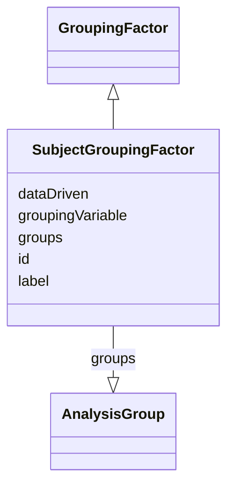

# Class: SubjectGroupingFactor


_A factor used to subdivide the subject population for comparative analysis (e.g., treatment, sex, race, age)._


URI: [ars:SubjectGroupingFactor](https://www.cdisc.org/ars/1-0/SubjectGroupingFactor)





## Inheritance
* [GroupingFactor](GroupingFactor.md)
    * **SubjectGroupingFactor**


## Slots

| Name | Cardinality and Range | Description | Inheritance |
| ---  | --- | --- | --- |
| [id](id.md) | 1..1 <br/> [String](String.md) | The assigned identifying value for the instance of the class | [GroupingFactor](GroupingFactor.md) |
| [label](label.md) | 0..1 <br/> [String](String.md) |  | [GroupingFactor](GroupingFactor.md) |
| [groupingVariable](groupingVariable.md) | 0..1 <br/> [String](String.md) | For groupings based on a single variable, a reference to the dataset variable... | [GroupingFactor](GroupingFactor.md) |
| [dataDriven](dataDriven.md) | 1..1 <br/> [Boolean](Boolean.md) | Indicates whether the groups defined by the grouping are prespecified (false)... | [GroupingFactor](GroupingFactor.md) |
| [groups](groups.md) | 0..* <br/> [AnalysisGroup](AnalysisGroup.md) | The pre-specified groups within the grouping | [GroupingFactor](GroupingFactor.md) |


## Usages

| used by | used in | type | used |
| ---  | --- | --- | --- |
| [ReportingEvent](ReportingEvent.md) | [analysisGroupings](analysisGroupings.md) | range | [SubjectGroupingFactor](SubjectGroupingFactor.md) |


## Identifier and Mapping Information


### Schema Source


* from schema: https://www.cdisc.org/ars/1-0


## Mappings

| Mapping Type | Mapped Value |
| ---  | ---  |
| self | ars:SubjectGroupingFactor |
| native | ars:SubjectGroupingFactor |


## LinkML Source

<!-- TODO: investigate https://stackoverflow.com/questions/37606292/how-to-create-tabbed-code-blocks-in-mkdocs-or-sphinx -->

### Direct

<details>
```yaml
name: SubjectGroupingFactor
description: A factor used to subdivide the subject population for comparative analysis
  (e.g., treatment, sex, race, age).
from_schema: https://www.cdisc.org/ars/1-0
rank: 1000
is_a: GroupingFactor
slot_usage:
  groups:
    name: groups
    domain_of:
    - GroupingFactor
    range: AnalysisGroup

```
</details>

### Induced

<details>
```yaml
name: SubjectGroupingFactor
description: A factor used to subdivide the subject population for comparative analysis
  (e.g., treatment, sex, race, age).
from_schema: https://www.cdisc.org/ars/1-0
rank: 1000
is_a: GroupingFactor
slot_usage:
  groups:
    name: groups
    domain_of:
    - GroupingFactor
    range: AnalysisGroup
attributes:
  id:
    name: id
    description: The assigned identifying value for the instance of the class.
    from_schema: https://www.cdisc.org/ars/1-0
    rank: 1000
    identifier: true
    alias: id
    owner: SubjectGroupingFactor
    domain_of:
    - ReportingEvent
    - AnalysisCategorization
    - AnalysisCategory
    - Analysis
    - AnalysisMethod
    - Operation
    - ReferencedOperationRelationship
    - Output
    - OutputDisplay
    - DisplaySubSection
    - AnalysisSet
    - GroupingFactor
    - Group
    - DataSubset
    - ReferenceDocument
    - TerminologyExtension
    - SponsorTerm
    range: string
    required: true
  label:
    name: label
    from_schema: https://www.cdisc.org/ars/1-0
    rank: 1000
    alias: label
    owner: SubjectGroupingFactor
    domain_of:
    - AnalysisCategorization
    - AnalysisCategory
    - AnalysisMethod
    - Operation
    - AnalysisSet
    - GroupingFactor
    - Group
    - DataSubset
    - PageRef
    range: string
  groupingVariable:
    name: groupingVariable
    description: For groupings based on a single variable, a reference to the dataset
      variable upon which grouping is based.
    from_schema: https://www.cdisc.org/ars/1-0
    rank: 1000
    alias: groupingVariable
    owner: SubjectGroupingFactor
    domain_of:
    - GroupingFactor
    range: string
  dataDriven:
    name: dataDriven
    description: Indicates whether the groups defined by the grouping are prespecified
      (false) or obtained from distinct data values of the groupingVariable (true).
    from_schema: https://www.cdisc.org/ars/1-0
    rank: 1000
    alias: dataDriven
    owner: SubjectGroupingFactor
    domain_of:
    - GroupingFactor
    range: boolean
    required: true
  groups:
    name: groups
    description: The pre-specified groups within the grouping.
    from_schema: https://www.cdisc.org/ars/1-0
    rank: 1000
    multivalued: true
    list_elements_ordered: true
    alias: groups
    owner: SubjectGroupingFactor
    domain_of:
    - GroupingFactor
    range: AnalysisGroup
    inlined: true
    inlined_as_list: true

```
</details>