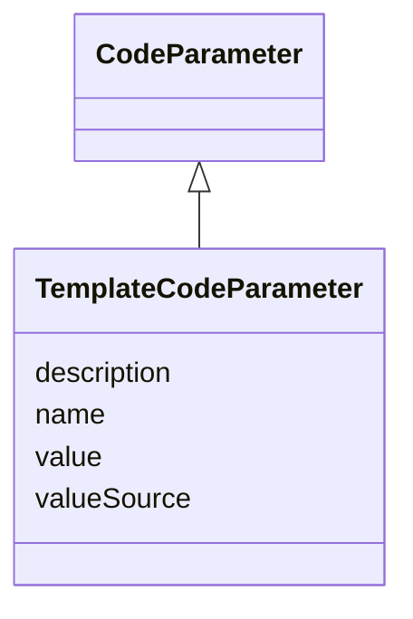

# Class: TemplateCodeParameter


_A replacement parameter whose value is substituted in template programming code to create statements required for a specific analysis._


URI: [ars:TemplateCodeParameter](https://www.cdisc.org/ars/1-0/TemplateCodeParameter)





## Inheritance
* [NamedObject](NamedObject.md)
    * [CodeParameter](CodeParameter.md)
        * **TemplateCodeParameter**


## Slots

| Name | Cardinality and Range | Description | Inheritance |
| ---  | --- | --- | --- |
| [valueSource](valueSource.md) | 0..1 <br/> [String](String.md) | A reference to the prespecified source of the value for the parameter | direct |
| [value](value.md) | 0..* <br/> [String](String.md) | The value to be used for the parameter when the method is used in an analysis | direct |
| [description](description.md) | 0..1 <br/> [String](String.md) | A textual description of the instance of the class | [CodeParameter](CodeParameter.md) |
| [name](name.md) | 1..1 <br/> [String](String.md) | The name for the instance of the class | [NamedObject](NamedObject.md) |


## Usages

| used by | used in | type | used |
| ---  | --- | --- | --- |
| [AnalysisProgrammingCodeTemplate](AnalysisProgrammingCodeTemplate.md) | [parameters](parameters.md) | range | [TemplateCodeParameter](TemplateCodeParameter.md) |


## Identifier and Mapping Information


### Schema Source


* from schema: https://www.cdisc.org/ars/1-0


## Mappings

| Mapping Type | Mapped Value |
| ---  | ---  |
| self | ars:TemplateCodeParameter |
| native | ars:TemplateCodeParameter |


## LinkML Source

<!-- TODO: investigate https://stackoverflow.com/questions/37606292/how-to-create-tabbed-code-blocks-in-mkdocs-or-sphinx -->

### Direct

<details>
```yaml
name: TemplateCodeParameter
description: A replacement parameter whose value is substituted in template programming
  code to create statements required for a specific analysis.
from_schema: https://www.cdisc.org/ars/1-0
rank: 1000
is_a: CodeParameter
slots:
- valueSource
- value
slot_usage:
  value:
    name: value
    description: The value to be used for the parameter when the method is used in
      an analysis. Multiple values may be specified to indicate a choice.
    domain_of:
    - AnalysisOutputCodeParameter
    - TemplateCodeParameter
    - WhereClauseCondition
    required: false

```
</details>

### Induced

<details>
```yaml
name: TemplateCodeParameter
description: A replacement parameter whose value is substituted in template programming
  code to create statements required for a specific analysis.
from_schema: https://www.cdisc.org/ars/1-0
rank: 1000
is_a: CodeParameter
slot_usage:
  value:
    name: value
    description: The value to be used for the parameter when the method is used in
      an analysis. Multiple values may be specified to indicate a choice.
    domain_of:
    - AnalysisOutputCodeParameter
    - TemplateCodeParameter
    - WhereClauseCondition
    required: false
attributes:
  valueSource:
    name: valueSource
    description: A reference to the prespecified source of the value for the parameter.
    from_schema: https://www.cdisc.org/ars/1-0
    rank: 1000
    alias: valueSource
    owner: TemplateCodeParameter
    domain_of:
    - TemplateCodeParameter
    range: string
  value:
    name: value
    description: The value to be used for the parameter when the method is used in
      an analysis. Multiple values may be specified to indicate a choice.
    from_schema: https://www.cdisc.org/ars/1-0
    rank: 1000
    multivalued: true
    alias: value
    owner: TemplateCodeParameter
    domain_of:
    - AnalysisOutputCodeParameter
    - TemplateCodeParameter
    - WhereClauseCondition
    range: string
    required: false
  description:
    name: description
    description: A textual description of the instance of the class.
    from_schema: https://www.cdisc.org/ars/1-0
    rank: 1000
    alias: description
    owner: TemplateCodeParameter
    domain_of:
    - Analysis
    - AnalysisMethod
    - ReferencedOperationRelationship
    - CodeParameter
    - SponsorTerm
    range: string
  name:
    name: name
    description: The name for the instance of the class.
    from_schema: https://www.cdisc.org/ars/1-0
    rank: 1000
    alias: name
    owner: TemplateCodeParameter
    domain_of:
    - NamedObject
    range: string
    required: true

```
</details>