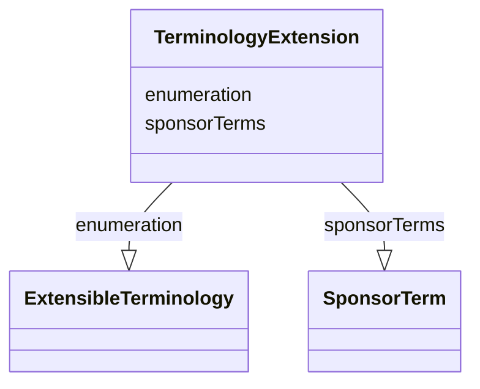

# Class: TerminologyExtension


_A sponsor-defined term that is included in an extensible set of controlled terminology._


URI: [ars:TerminologyExtension](https://www.cdisc.org/ars/1-0/TerminologyExtension)





<!-- no inheritance hierarchy -->


## Slots

| Name | Cardinality and Range | Description | Inheritance |
| ---  | --- | --- | --- |
| [enumeration](enumeration.md) | 0..1 <br/> [ExtensibleTerminology](ExtensibleTerminology.md) | The name of the extensible enumeration | direct |
| [sponsorTerms](sponsorTerms.md) | 1..* <br/> [SponsorTerm](SponsorTerm.md) | The sponsor-defined terms added to the extensible terminology | direct |


## Usages

| used by | used in | type | used |
| ---  | --- | --- | --- |
| [ReportingEvent](ReportingEvent.md) | [terminologyExtentions](terminologyExtentions.md) | range | [TerminologyExtension](TerminologyExtension.md) |


## Identifier and Mapping Information


### Schema Source


* from schema: https://www.cdisc.org/ars/1-0


## Mappings

| Mapping Type | Mapped Value |
| ---  | ---  |
| self | ars:TerminologyExtension |
| native | ars:TerminologyExtension |


## LinkML Source

<!-- TODO: investigate https://stackoverflow.com/questions/37606292/how-to-create-tabbed-code-blocks-in-mkdocs-or-sphinx -->

### Direct

<details>
```yaml
name: TerminologyExtension
description: A sponsor-defined term that is included in an extensible set of controlled
  terminology.
from_schema: https://www.cdisc.org/ars/1-0
rank: 1000
slots:
- enumeration
- sponsorTerms
unique_keys:
  enumeration:
    unique_key_name: enumeration
    unique_key_slots:
    - enumeration
    description: There should only be one terminology extension for any enumeration,
      which of which may contain multiple sponsor terms.

```
</details>

### Induced

<details>
```yaml
name: TerminologyExtension
description: A sponsor-defined term that is included in an extensible set of controlled
  terminology.
from_schema: https://www.cdisc.org/ars/1-0
rank: 1000
attributes:
  enumeration:
    name: enumeration
    description: The name of the extensible enumeration.
    from_schema: https://www.cdisc.org/ars/1-0
    rank: 1000
    alias: enumeration
    owner: TerminologyExtension
    domain_of:
    - TerminologyExtension
    range: ExtensibleTerminology
  sponsorTerms:
    name: sponsorTerms
    description: The sponsor-defined terms added to the extensible terminology.
    from_schema: https://www.cdisc.org/ars/1-0
    rank: 1000
    multivalued: true
    alias: sponsorTerms
    owner: TerminologyExtension
    domain_of:
    - TerminologyExtension
    range: SponsorTerm
    required: true
    inlined: true
    inlined_as_list: true
unique_keys:
  enumeration:
    unique_key_name: enumeration
    unique_key_slots:
    - enumeration
    description: There should only be one terminology extension for any enumeration,
      which of which may contain multiple sponsor terms.

```
</details>