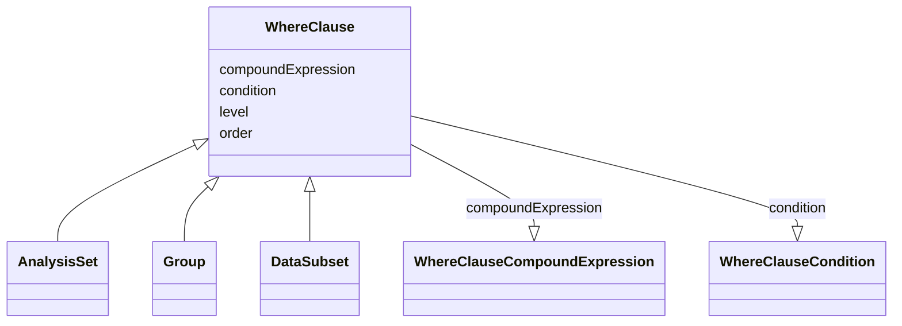

# Class: WhereClause


URI: [ars:WhereClause](https://www.cdisc.org/ars/1-0/WhereClause)





## Inheritance
* **WhereClause**
    * [AnalysisSet](AnalysisSet.md)
    * [Group](Group.md)
    * [DataSubset](DataSubset.md)


## Slots

| Name | Cardinality and Range | Description | Inheritance |
| ---  | --- | --- | --- |
| [level](level.md) | 0..1 <br/> [Integer](Integer.md) |  | direct |
| [order](order.md) | 0..1 <br/> [Integer](Integer.md) |  | direct |
| [condition](condition.md) | 0..1 <br/> [WhereClauseCondition](WhereClauseCondition.md) |  | direct |
| [compoundExpression](compoundExpression.md) | 0..1 <br/> [WhereClauseCompoundExpression](WhereClauseCompoundExpression.md) |  | direct |


## Usages

| used by | used in | type | used |
| ---  | --- | --- | --- |
| [WhereClauseCompoundExpression](WhereClauseCompoundExpression.md) | [whereClauses](whereClauses.md) | range | [WhereClause](WhereClause.md) |
| [CompoundSubsetExpression](CompoundSubsetExpression.md) | [whereClauses](whereClauses.md) | range | [WhereClause](WhereClause.md) |


## Identifier and Mapping Information


### Schema Source


* from schema: https://www.cdisc.org/ars/1-0


## Mappings

| Mapping Type | Mapped Value |
| ---  | ---  |
| self | ars:WhereClause |
| native | ars:WhereClause |


## LinkML Source

<!-- TODO: investigate https://stackoverflow.com/questions/37606292/how-to-create-tabbed-code-blocks-in-mkdocs-or-sphinx -->

### Direct

<details>
```yaml
name: WhereClause
from_schema: https://www.cdisc.org/ars/1-0
rank: 1000
slots:
- level
- order
- condition
- compoundExpression

```
</details>

### Induced

<details>
```yaml
name: WhereClause
from_schema: https://www.cdisc.org/ars/1-0
rank: 1000
attributes:
  level:
    name: level
    from_schema: https://www.cdisc.org/ars/1-0
    rank: 1000
    alias: level
    owner: WhereClause
    domain_of:
    - OrderedListItem
    - WhereClause
    range: integer
  order:
    name: order
    from_schema: https://www.cdisc.org/ars/1-0
    rank: 1000
    alias: order
    owner: WhereClause
    domain_of:
    - OrderedListItem
    - OrderedGroupingFactor
    - OrderedDisplay
    - DisplaySubSection
    - WhereClause
    range: integer
  condition:
    name: condition
    from_schema: https://www.cdisc.org/ars/1-0
    rank: 1000
    alias: condition
    owner: WhereClause
    domain_of:
    - WhereClause
    range: WhereClauseCondition
  compoundExpression:
    name: compoundExpression
    from_schema: https://www.cdisc.org/ars/1-0
    rank: 1000
    alias: compoundExpression
    owner: WhereClause
    domain_of:
    - WhereClause
    range: WhereClauseCompoundExpression

```
</details>