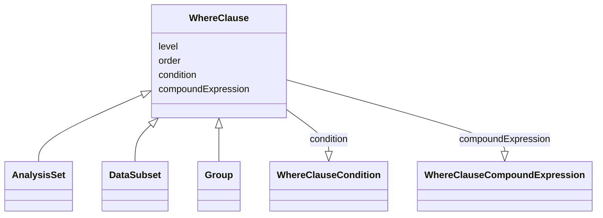

# Class: WhereClause

_Selection criteria defined as either a simple condition ([variable] [comparator] [value(s)]) or a compound expression that may combine simple conditions or compound expressions._


URI: [ars:WhereClause](https://www.cdisc.org/ars/1-0/WhereClause)





## Inheritance
* **WhereClause**
    * [AnalysisSet](AnalysisSet.md)
    * [DataSubset](DataSubset.md)
    * [Group](Group.md)


## Slots

| Name | Cardinality* and Range | Description | Inheritance |
| ---  | --- | --- | --- |
| [level](level.md) | 1..1 <br/> [Integer](Integer.md) | The level of the entry within a hierarchical structure | direct |
| [order](order.md) | 1..1 <br/> [Integer](Integer.md) | The ordinal of the instance with respect to other instances | direct |
| [condition](condition.md) | 0..1 <br/> [WhereClauseCondition](WhereClauseCondition.md) | A simple selection criterion exressed as [dataset] | direct |
| [compoundExpression](compoundExpression.md) | 0..1 <br/> [WhereClauseCompoundExpression](WhereClauseCompoundExpression.md) | A compound expression that combines or negates where clauses | direct |

_* See [LinkML documentation](https://linkml.io/linkml/schemas/slots.html#slot-cardinality) for cardinality definitions._


## Usages

| used by | used in | type | used |
| ---  | --- | --- | --- |
| [WhereClauseCompoundExpression](WhereClauseCompoundExpression.md) | [whereClauses](whereClauses.md) | range | [WhereClause](WhereClause.md) |
| [CompoundSubsetExpression](CompoundSubsetExpression.md) | [whereClauses](whereClauses.md) | range | [WhereClause](WhereClause.md) |


## Comments

* Each instance of this class should have either a condition or a compoundExpression, not both.

## Identifier and Mapping Information


### Schema Source


* from schema: https://www.cdisc.org/ars/1-0


## Mappings

| Mapping Type | Mapped Value |
| ---  | ---  |
| self | ars:WhereClause |
| native | ars:WhereClause |


## Examples
### Example: WhereClause-01 condition

```yaml
# Simple condition: (ADSL.SAFFL EQ 'Y')
order: 1
level: 1
condition:
  dataset: ADSL
  variable: SAFFL
  comparator: EQ
  value:
  - Y
```
### Example: WhereClause-02 compoundExpression

```yaml
# Compound expression: (    ADAE.TRTEMFL EQ 'Y'
#                       AND ADAE.AESDTH EQ 'Y'
#                       AND (   ADAE.AEREL EQ 'POSSIBLE'
#                            OR ADAE.AEREL EQ 'PROBABLE'))
level: 1
order: 1
compoundExpression:
  logicalOperator: AND
  whereClauses:
  - level: 2
    order: 1
    condition:
      dataset: ADAE
      variable: TRTEMFL
      comparator: EQ
      value:
      - Y
  - level: 2
    order: 2
    condition:
      dataset: ADAE
      variable: AESDTH
      comparator: EQ
      value:
      - Y
  - level: 2
    order: 3
    compoundExpression:
      logicalOperator: OR
      whereClauses:
      - level: 3
        order: 1
        condition:
          dataset: ADAE
          variable: AEREL
          comparator: EQ
          value:
          - POSSIBLE
      - level: 3
        order: 2
        condition:
          dataset: ADAE
          variable: AEREL
          comparator: EQ
          value:
          - PROBABLE
```


## LinkML Source

<!-- TODO: investigate https://stackoverflow.com/questions/37606292/how-to-create-tabbed-code-blocks-in-mkdocs-or-sphinx -->

### Direct

<details>
```yaml
name: WhereClause
description: Selection criteria defined as either a simple condition ([variable] [comparator]
  [value(s)]) or a compound expression that may combine simple conditions or compound
  expressions.
comments:
- Each instance of this class should have either a condition or a compoundExpression,
  not both.
from_schema: https://www.cdisc.org/ars/1-0
rank: 1000
slots:
- level
- order
- condition
- compoundExpression

```
</details>

### Induced

<details>
```yaml
name: WhereClause
description: Selection criteria defined as either a simple condition ([variable] [comparator]
  [value(s)]) or a compound expression that may combine simple conditions or compound
  expressions.
comments:
- Each instance of this class should have either a condition or a compoundExpression,
  not both.
from_schema: https://www.cdisc.org/ars/1-0
rank: 1000
attributes:
  level:
    name: level
    description: The level of the entry within a hierarchical structure.
    comments:
    - 1 is the top level.
    from_schema: https://www.cdisc.org/ars/1-0
    rank: 1000
    alias: level
    owner: WhereClause
    domain_of:
    - OrderedListItem
    - WhereClause
    range: integer
    required: true
  order:
    name: order
    description: The ordinal of the instance with respect to other instances.
    from_schema: https://www.cdisc.org/ars/1-0
    rank: 1000
    alias: order
    owner: WhereClause
    domain_of:
    - OrderedListItem
    - WhereClause
    - Operation
    - OrderedGroupingFactor
    - OrderedDisplay
    - OrderedDisplaySubSection
    range: integer
    required: true
  condition:
    name: condition
    description: A simple selection criterion exressed as [dataset].[variable] [comparator]
      [value(s)]
    from_schema: https://www.cdisc.org/ars/1-0
    rank: 1000
    alias: condition
    owner: WhereClause
    domain_of:
    - WhereClause
    range: WhereClauseCondition
  compoundExpression:
    name: compoundExpression
    description: A compound expression that combines or negates where clauses.
    from_schema: https://www.cdisc.org/ars/1-0
    rank: 1000
    alias: compoundExpression
    owner: WhereClause
    domain_of:
    - WhereClause
    range: WhereClauseCompoundExpression

```
</details>