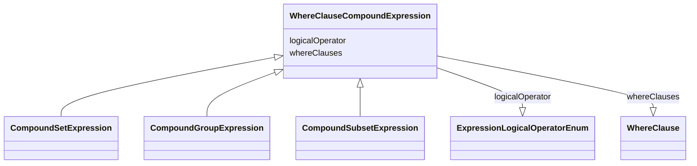

# Class: WhereClauseCompoundExpression


_A compound expression consisting of either two or more where clauses combined with the `AND` or `OR` logical operator, or a single where clause negated with the `NOT` logical operator._


URI: [ars:WhereClauseCompoundExpression](https://www.cdisc.org/ars/1-0/WhereClauseCompoundExpression)





## Inheritance
* **WhereClauseCompoundExpression**
    * [CompoundSetExpression](CompoundSetExpression.md)
    * [CompoundGroupExpression](CompoundGroupExpression.md)
    * [CompoundSubsetExpression](CompoundSubsetExpression.md)


## Slots

| Name | Cardinality and Range | Description | Inheritance |
| ---  | --- | --- | --- |
| [logicalOperator](logicalOperator.md) | 1..1 <br/> [ExpressionLogicalOperatorEnum](ExpressionLogicalOperatorEnum.md) | The boolean operator that is used to combine (AND, OR) or negate (NOT) the wh... | direct |
| [whereClauses](whereClauses.md) | 0..* <br/> [WhereClause](WhereClause.md) | A list of one or more where clauses (selection criteria) to be combined or ne... | direct |


## Usages

| used by | used in | type | used |
| ---  | --- | --- | --- |
| [WhereClause](WhereClause.md) | [compoundExpression](compoundExpression.md) | range | [WhereClauseCompoundExpression](WhereClauseCompoundExpression.md) |


## Identifier and Mapping Information


### Schema Source


* from schema: https://www.cdisc.org/ars/1-0


## Mappings

| Mapping Type | Mapped Value |
| ---  | ---  |
| self | ars:WhereClauseCompoundExpression |
| native | ars:WhereClauseCompoundExpression |


## Examples
### Example: WhereClauseCompoundExpression-01 AND

```yaml
# Compound expression: (    ADAE.TRTEMFL EQ 'Y'
#                       AND ADAE.AESDTH EQ 'Y')
logicalOperator: AND
whereClauses:
- level: 2
  order: 1
  condition:
    dataset: ADAE
    variable: TRTEMFL
    comparator: EQ
    value:
    - Y
- level: 2
  order: 2
  condition:
    dataset: ADAE
    variable: AESDTH
    comparator: EQ
    value:
    - Y
```
### Example: WhereClauseCompoundExpression-02 NOT with OR

```yaml
# Compound expression: NOT (ADXX.VAR1 IN ('value 1','value 2') OR ADXX.VAR2 GT 37)
logicalOperator: NOT
whereClauses:
- level: 2
  order: 1
  compoundExpression:
    logicalOperator: OR
    whereClauses:
    - level: 3
      order: 1
      condition:
        dataset: ADXX
        variable: VAR1
        comparator: IN
        value:
        - value 1
        - value 2
    - level: 3
      order: 2
      condition:
        dataset: ADXX
        variable: VAR2
        comparator: GT
        value:
        - 37
```


## LinkML Source

<!-- TODO: investigate https://stackoverflow.com/questions/37606292/how-to-create-tabbed-code-blocks-in-mkdocs-or-sphinx -->

### Direct

<details>
```yaml
name: WhereClauseCompoundExpression
description: A compound expression consisting of either two or more where clauses
  combined with the `AND` or `OR` logical operator, or a single where clause negated
  with the `NOT` logical operator.
from_schema: https://www.cdisc.org/ars/1-0
rank: 1000
slots:
- logicalOperator
- whereClauses
rules:
- preconditions:
    slot_conditions:
      logicalOperator:
        name: logicalOperator
        any_of:
        - equals_string: AND
        - equals_string: OR
  postconditions:
    slot_conditions:
      whereClauses:
        name: whereClauses
        minimum_cardinality: 2
  description: At least 2 where clauses are required when logicalOperator is AND or
    OR.
- preconditions:
    slot_conditions:
      logicalOperator:
        name: logicalOperator
        equals_string: NOT
  postconditions:
    slot_conditions:
      value:
        name: value
        maximum_cardinality: 1
  description: Only a single where clause is allowed when logicalOperator is NOT.

```
</details>

### Induced

<details>
```yaml
name: WhereClauseCompoundExpression
description: A compound expression consisting of either two or more where clauses
  combined with the `AND` or `OR` logical operator, or a single where clause negated
  with the `NOT` logical operator.
from_schema: https://www.cdisc.org/ars/1-0
rank: 1000
attributes:
  logicalOperator:
    name: logicalOperator
    description: The boolean operator that is used to combine (AND, OR) or negate
      (NOT) the where claus(s) in the compound expression.
    from_schema: https://www.cdisc.org/ars/1-0
    rank: 1000
    alias: logicalOperator
    owner: WhereClauseCompoundExpression
    domain_of:
    - WhereClauseCompoundExpression
    range: ExpressionLogicalOperatorEnum
    required: true
  whereClauses:
    name: whereClauses
    description: A list of one or more where clauses (selection criteria) to be combined
      or negated.
    comments:
    - Each where clause may be defined as either a simple condition ([variable] [comparator]
      [value(s)]) or a compound expression that may combine additional simple conditions
      or compound expressions.
    - Two or more where clauses should be specified when the logical operator is AND
      or OR.
    - Only one where clause should be specfied when the logical operator is NOT. This
      where clause will usually be a compound expression.
    from_schema: https://www.cdisc.org/ars/1-0
    rank: 1000
    multivalued: true
    list_elements_ordered: true
    alias: whereClauses
    owner: WhereClauseCompoundExpression
    domain_of:
    - WhereClauseCompoundExpression
    range: WhereClause
    inlined: false
rules:
- preconditions:
    slot_conditions:
      logicalOperator:
        name: logicalOperator
        any_of:
        - equals_string: AND
        - equals_string: OR
  postconditions:
    slot_conditions:
      whereClauses:
        name: whereClauses
        minimum_cardinality: 2
  description: At least 2 where clauses are required when logicalOperator is AND or
    OR.
- preconditions:
    slot_conditions:
      logicalOperator:
        name: logicalOperator
        equals_string: NOT
  postconditions:
    slot_conditions:
      value:
        name: value
        maximum_cardinality: 1
  description: Only a single where clause is allowed when logicalOperator is NOT.

```
</details>