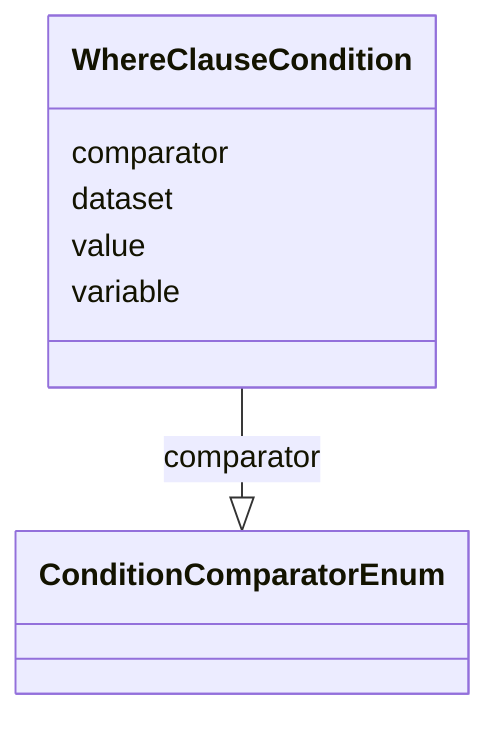

# Class: WhereClauseCondition

_A simple selection criterion exressed as [dataset].[variable] [comparator] [value(s)]_


URI: [ars:WhereClauseCondition](https://www.cdisc.org/ars/1-0/WhereClauseCondition)





<!-- no inheritance hierarchy -->


## Slots

| Name | Cardinality* and Range | Description | Inheritance |
| ---  | --- | --- | --- |
| [dataset](dataset.md) | 0..1 <br/> [String](String.md) | The name of the analysis dataset | direct |
| [variable](variable.md) | 0..1 <br/> [String](String.md) | The name of the variable | direct |
| [comparator](comparator.md) | 0..1 <br/> [ConditionComparatorEnum](ConditionComparatorEnum.md) | Comparison operator indicating how the variable is compared to the value(s) | direct |
| [value](value.md) | 0..* <br/> [String](String.md) | The value(s) for comparison with the variable | direct |

_* See [LinkML documentation](https://linkml.io/linkml/schemas/slots.html#slot-cardinality) for cardinality definitions._


## Usages

| used by | used in | type | used |
| ---  | --- | --- | --- |
| [WhereClause](WhereClause.md) | [condition](condition.md) | range | [WhereClauseCondition](WhereClauseCondition.md) |
| [AnalysisSet](AnalysisSet.md) | [condition](condition.md) | range | [WhereClauseCondition](WhereClauseCondition.md) |
| [DataSubset](DataSubset.md) | [condition](condition.md) | range | [WhereClauseCondition](WhereClauseCondition.md) |
| [Group](Group.md) | [condition](condition.md) | range | [WhereClauseCondition](WhereClauseCondition.md) |
| [AnalysisGroup](AnalysisGroup.md) | [condition](condition.md) | range | [WhereClauseCondition](WhereClauseCondition.md) |
| [DataGroup](DataGroup.md) | [condition](condition.md) | range | [WhereClauseCondition](WhereClauseCondition.md) |


## Examples

| Value |
| --- |
| ADSL.SAFFL EQ 'Y' |

## Identifier and Mapping Information


### Schema Source


* from schema: https://www.cdisc.org/ars/1-0


## Mappings

| Mapping Type | Mapped Value |
| ---  | ---  |
| self | ars:WhereClauseCondition |
| native | ars:WhereClauseCondition |


## LinkML Source

<!-- TODO: investigate https://stackoverflow.com/questions/37606292/how-to-create-tabbed-code-blocks-in-mkdocs-or-sphinx -->

### Direct

<details>
```yaml
name: WhereClauseCondition
description: A simple selection criterion exressed as [dataset].[variable] [comparator]
  [value(s)]
examples:
- value: ADSL.SAFFL EQ 'Y'
from_schema: https://www.cdisc.org/ars/1-0
rank: 1000
slots:
- dataset
- variable
- comparator
- value
slot_usage:
  value:
    name: value
    description: The value(s) for comparison with the variable.
    domain_of:
    - WhereClauseCondition
    - TemplateCodeParameter
    - AnalysisOutputCodeParameter
    required: false

```
</details>

### Induced

<details>
```yaml
name: WhereClauseCondition
description: A simple selection criterion exressed as [dataset].[variable] [comparator]
  [value(s)]
examples:
- value: ADSL.SAFFL EQ 'Y'
from_schema: https://www.cdisc.org/ars/1-0
rank: 1000
slot_usage:
  value:
    name: value
    description: The value(s) for comparison with the variable.
    domain_of:
    - WhereClauseCondition
    - TemplateCodeParameter
    - AnalysisOutputCodeParameter
    required: false
attributes:
  dataset:
    name: dataset
    description: The name of the analysis dataset.
    from_schema: https://www.cdisc.org/ars/1-0
    rank: 1000
    alias: dataset
    owner: WhereClauseCondition
    domain_of:
    - WhereClauseCondition
    - Analysis
    range: string
  variable:
    name: variable
    description: The name of the variable.
    from_schema: https://www.cdisc.org/ars/1-0
    rank: 1000
    alias: variable
    owner: WhereClauseCondition
    domain_of:
    - WhereClauseCondition
    - Analysis
    range: string
  comparator:
    name: comparator
    description: Comparison operator indicating how the variable is compared to the
      value(s).
    from_schema: https://www.cdisc.org/ars/1-0
    rank: 1000
    alias: comparator
    owner: WhereClauseCondition
    domain_of:
    - WhereClauseCondition
    range: ConditionComparatorEnum
  value:
    name: value
    description: The value(s) for comparison with the variable.
    from_schema: https://www.cdisc.org/ars/1-0
    rank: 1000
    multivalued: true
    alias: value
    owner: WhereClauseCondition
    domain_of:
    - WhereClauseCondition
    - TemplateCodeParameter
    - AnalysisOutputCodeParameter
    range: string
    required: false

```
</details>