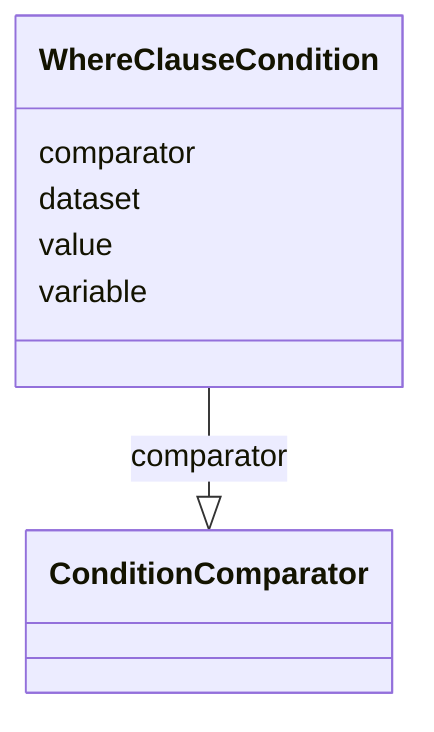

# Class: WhereClauseCondition


URI: [ars:WhereClauseCondition](https://www.cdisc.org/ars/1-0/WhereClauseCondition)





<!-- no inheritance hierarchy -->


## Slots

| Name | Cardinality and Range | Description | Inheritance |
| ---  | --- | --- | --- |
| [dataset](dataset.md) | 0..1 <br/> [String](String.md) |  | direct |
| [variable](variable.md) | 0..1 <br/> [String](String.md) |  | direct |
| [comparator](comparator.md) | 0..1 <br/> [ConditionComparator](ConditionComparator.md) |  | direct |
| [value](value.md) | 0..1 <br/> [String](String.md) |  | direct |


## Usages

| used by | used in | type | used |
| ---  | --- | --- | --- |
| [WhereClause](WhereClause.md) | [condition](condition.md) | range | [WhereClauseCondition](WhereClauseCondition.md) |
| [AnalysisSet](AnalysisSet.md) | [condition](condition.md) | range | [WhereClauseCondition](WhereClauseCondition.md) |
| [Group](Group.md) | [condition](condition.md) | range | [WhereClauseCondition](WhereClauseCondition.md) |
| [AnalysisGroup](AnalysisGroup.md) | [condition](condition.md) | range | [WhereClauseCondition](WhereClauseCondition.md) |
| [DataGroup](DataGroup.md) | [condition](condition.md) | range | [WhereClauseCondition](WhereClauseCondition.md) |
| [DataSubset](DataSubset.md) | [condition](condition.md) | range | [WhereClauseCondition](WhereClauseCondition.md) |


## Identifier and Mapping Information


### Schema Source


* from schema: https://www.cdisc.org/ars/1-0


## Mappings

| Mapping Type | Mapped Value |
| ---  | ---  |
| self | ars:WhereClauseCondition |
| native | ars:WhereClauseCondition |


## LinkML Source

<!-- TODO: investigate https://stackoverflow.com/questions/37606292/how-to-create-tabbed-code-blocks-in-mkdocs-or-sphinx -->

### Direct

<details>
```yaml
name: WhereClauseCondition
from_schema: https://www.cdisc.org/ars/1-0
rank: 1000
slots:
- dataset
- variable
- comparator
- value
rules:
- preconditions:
    slot_conditions:
      comparator:
        name: comparator
        any_of:
        - equals_string: EQ
        - equals_string: NE
        - equals_string: LT
        - equals_string: LE
        - equals_string: GT
        - equals_string: GE
  postconditions:
    slot_conditions:
      value:
        name: value
        multivalued: false
  description: Only a single value is allowed when comparator is EQ, NE, LT, LE, GT,
    or GE.
- preconditions:
    slot_conditions:
      comparator:
        name: comparator
        any_of:
        - equals_string: IN
        - equals_string: NOTIN
  postconditions:
    slot_conditions:
      value:
        name: value
        multivalued: true
  description: Multile values are allowed when comparator is IN or NOTIN.

```
</details>

### Induced

<details>
```yaml
name: WhereClauseCondition
from_schema: https://www.cdisc.org/ars/1-0
rank: 1000
attributes:
  dataset:
    name: dataset
    from_schema: https://www.cdisc.org/ars/1-0
    rank: 1000
    alias: dataset
    owner: WhereClauseCondition
    domain_of:
    - Analysis
    - WhereClauseCondition
    range: string
  variable:
    name: variable
    from_schema: https://www.cdisc.org/ars/1-0
    rank: 1000
    alias: variable
    owner: WhereClauseCondition
    domain_of:
    - Analysis
    - WhereClauseCondition
    range: string
  comparator:
    name: comparator
    from_schema: https://www.cdisc.org/ars/1-0
    rank: 1000
    alias: comparator
    owner: WhereClauseCondition
    domain_of:
    - WhereClauseCondition
    range: ConditionComparator
  value:
    name: value
    from_schema: https://www.cdisc.org/ars/1-0
    rank: 1000
    alias: value
    owner: WhereClauseCondition
    domain_of:
    - CodeParameter
    - WhereClauseCondition
    range: string
rules:
- preconditions:
    slot_conditions:
      comparator:
        name: comparator
        any_of:
        - equals_string: EQ
        - equals_string: NE
        - equals_string: LT
        - equals_string: LE
        - equals_string: GT
        - equals_string: GE
  postconditions:
    slot_conditions:
      value:
        name: value
        multivalued: false
  description: Only a single value is allowed when comparator is EQ, NE, LT, LE, GT,
    or GE.
- preconditions:
    slot_conditions:
      comparator:
        name: comparator
        any_of:
        - equals_string: IN
        - equals_string: NOTIN
  postconditions:
    slot_conditions:
      value:
        name: value
        multivalued: true
  description: Multile values are allowed when comparator is IN or NOTIN.

```
</details>